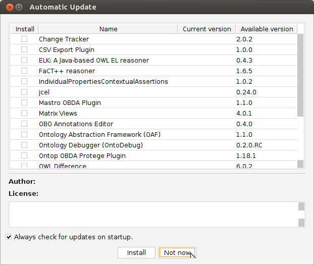
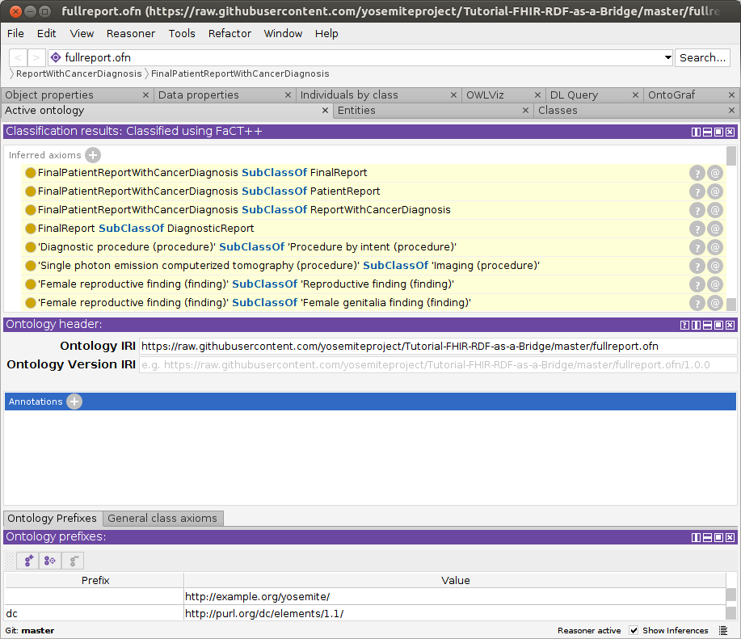
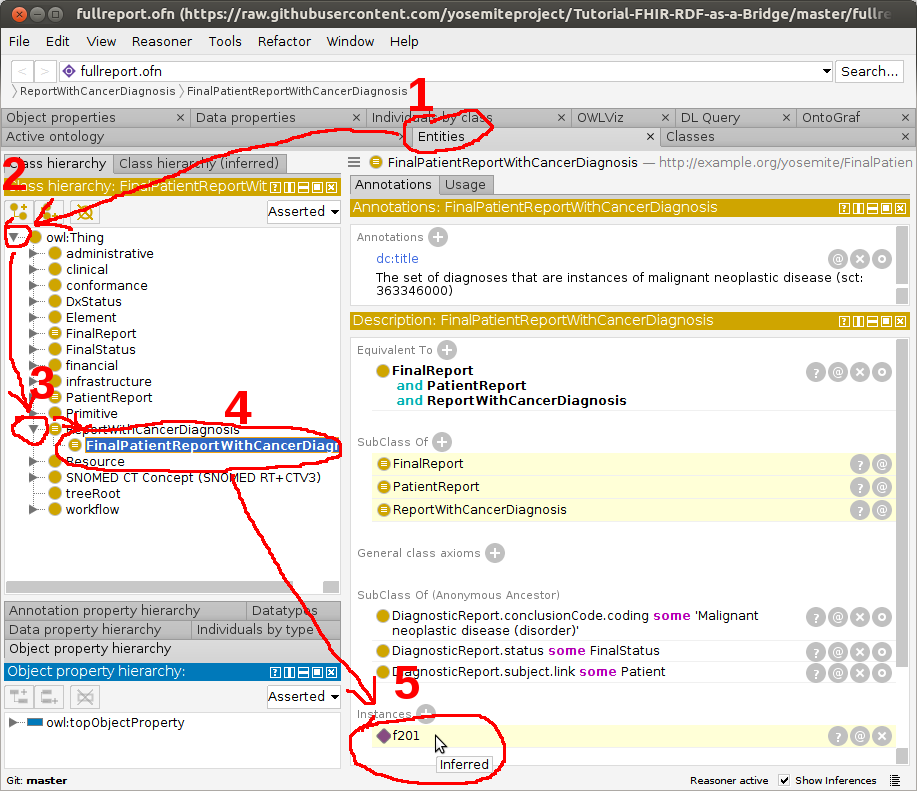
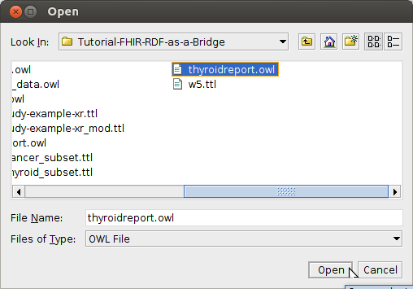
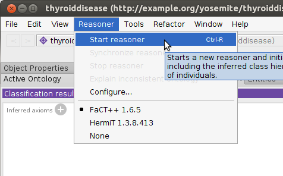
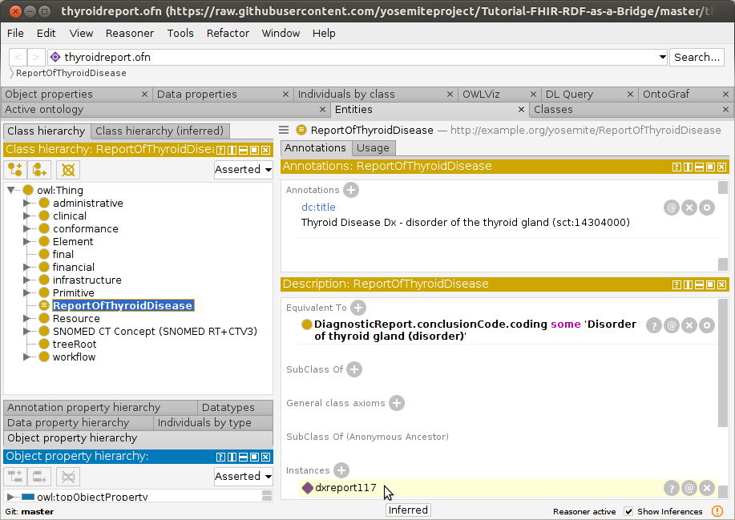

# FHIR RDF as a Bridge to the Semantic Web in Healthcare

This tutorial shows how [FHIR RDF](https://www.hl7.org/fhir/rdf.html) medical records using SNOMED-CT codes can be processed
by a reasoner to identify diagnoses that were not directly coded.  Two
examples are demonstrated:
a FHIR DiagnosticReport for malignant
neoplasm is inferred to be an instance of CancerDiagnosis; and
a report of a thyroid tumor is inferred to be a thyroid disease diagnosis.

This approach is useful in primary and
secondary care institutions to count or identify patients
that belong to a particular group of diagnoses.
Instead of explicitly querying for every possible code
that would indicate the target diagnosis -- such as cancer or thyroid 
disease -- 
the reasoner uses SNOMED-CT's ontology to infer that diagnosis based
on subclass relationships.

This tutorial is based on a 
[Yosemite Project webinar](http://yosemiteproject.org/fhir-rdf-as-a-bridge-to-the-semantic-web-in-healthcare/)
and a [paper from the 2017 International SWAT4HCLS Conference](http://www.swat4ls.org/wp-content/uploads/2017/11/SWAT4LS-2017_paper_28.pdf)
by Harold R. Solbrig of Mayo Clinic.  

## Target audience
Anyone interested in using FHIR/RDF to perform inference using the SNOMED-CT ontology.

## Prerequisites
* Familiarity with semantic web technologies and standards, including [OWL](http://www.w3.org/TR/owl-primer), [RDF](https://www.w3.org/TR/rdf11-primer/), and the [Protege ontology editor](https://protege.stanford.edu/)
* Familiarity with health informatics standards, including [SNOMED-CT](https://en.wikipedia.org/wiki/SNOMED_CT) and [HL7 FHIR](https://www.hl7.org/fhir/)
  
## Steps

1. Install a current version of [Protege](https://protege.stanford.edu/products.php).  This tutorial was tested on 5.5.0beta9.

   *For convenience we will use Protege with the FaCT++ reasoner to
   perform the inference that will identify a FHIR patient record as
   a cancer diagnosis.  However, if you 
   wanted to perform this inference in a production system you probably
   would not do it in Protege.*

2. Clone a copy of [this repository](https://github.com/yosemiteproject/Tutorial-FHIR-RDF-as-a-Bridge/master), which contains the files for this tutorial, and change to that directory.

   ```
   git clone https://github.com/yosemiteproject/Tutorial-FHIR-RDF-as-a-Bridge/master
   cd Tutorial-FHIR-RDF-as-a-Bridge/master
   ```

3. Start Protege.  If you get an "Automatic Update" dialog, you may dismiss it
by clicking "Not now".  

   
   

4. Verify that the FaCT++ reasoner is installed: click the Reasoner menu
to see if FaCT++ is listed.  If not, install it directly from Protege:
File-->Check for plugins..., check "FaCT++ reasoner", Install, then exit
and restart Protege.  <br />


5. Open [fullreport.ofn](fullreport.ofn): File-->Open.
This OWL file references a sample FHIR/RDF patient data record (f201.ttl)
that we will identify as a cancer diagnosis, using the FaCT++ reasoner.  
It also references the various FHIR and SNOMED-CT ontology pieces that enable 
the reasoner to reach this conclusion.  If needed, resolve missing imports using these local files:
   ```
   snomed_cancer_subset.ttl
   fhir.ttl
   w5.ttl
   diagnosticreport-example-f201-brainct.ttl
   patientreport.ofn
   cancerreport.ofn
   finalreport.ofn
   ```


6. Select the FaCT++ reasoner under the `Reasoner` menu.  <br />


7. Select `Start Reasoner` under the `Reasoner` menu.  It took ~30
seconds to run on a 3.4GHz laptop.  <br />




8. After the reasoner has finished, navigate to `FinalPatientReportWithCancerDiagnosis` in the `Classes`-->`Class hierarchy` tab and observe that `f201` (the id of the DiagnosticReport) has been recognized as an instance.  Success!
This means that the reasoner has concluded that this patient record (f201)
has a cancer diagnosis.  <br />


   Next, we will test a different patient record for a thyroid disease diagnosis.

9. Open [thyroidreport.ofn](thyroidreport.ofn), answering "no" to the current window prompt.
Again, this file imports the ontologies that we need, imports the patient
record that will be tested (diagnosticreport-example-dxreport117-thyroidtumor.ttl),
and defines our target diagnosis class (`:ReportOfThyroidDisease`)
as being anything classified in SNOMED-CT as a
disorder of the thyroid gland (code [sct:14304000](http://snomed.info/id/14304000]).  <br />


10. Select `Start Reasoner` under the `Reasoner` menu.  It took ~2 minutes
to run on a 3.4GHz laptop.  <br />


11. Navigate to `ReportOfThyroidDisease` in the `Class Hierarchy` tab and observe that `dxreport117` has been classified
as an instance of thyroid disease.  <br />


## How it works
To further understand how this demo works, examine the roles and contents of
the files listed below.  

### Class definitions
These are OWL files we created to specify the kinds of diagnoses that we 
wish to identify, such as cancer or thyroid disease.

* [fullreport.ofn](fullreport.ofn) -- Class definition for `:FinalPatientReportWithCancerDiagnosis`, which is a final patient report of cancer diagnosis.  This class is the intersection of three classes defined in separate files:
  * `:PatientReport`
  * `:FinalReport`
  * `:ReportWithCancerDiagnosis`
* [patientreport.ofn](patientreport.ofn) -- Class definition for `:PatientReport`, i.e., all reports whose subject is a fhir:Patient
* [finalreport.ofn](finalreport.ofn) -- Class definition for `:FinalReport`, i.e., all reports whose status meets our criteria for finalized
* [cancerreport.ofn](cancerreport.ofn) -- Class definition for `:ReportWithCancerDiagnosis`, which are reports having a diagnosis of any [363346000: Malignant neoplastic disease](http://snomed.info/id/363346000).
* [thyroidreport.ofn](thyroidreport.ofn) -- Class definition for `:ReportOfThyroidDisease`, which are reports having a diagnosis of any [14304000: Disorder of thyroid gland (disorder)](http://snomed.info/id/14304000).
* [finalreport_text.ofn](finalreport_text.ofn) -- [Not used in this tutorial]  Class definition for `:FinalReport` whose status **text** matches what we think counts as "finalized".  This is a potential alternate way of defining the `:FinalReport` class.

### Instance data
These files represent the FHIR medical reports that are to be analyzed
to determine whether they represent the target diagnosis, such as
cancer or thyroid disease.  They were originally downloaded from
the [HL7 FHIR](https://www.hl7.org/fhir/) site, but snapshots of these
files are included here to insure that this tutorial 
will still work correctly even if those examples are moved or modified
on the HL7 site.  For this reason, these files were modified to point to
these github versions instead of pointing to the original versions on
the HL7 site.  One way to see what lines were changed is to search 
for the word "github" within these files.

* [diagnosticreport-example-f201-brainct.ttl](diagnosticreport-example-f201-brainct.ttl) -- This report contains a diagnosis of [188340000: Malignant tumor of craniopharyngeal duct (disorder) ](http://snomed.info/id/188340000).  Using the SNOMED-CT ontology, the reasoner will conclude that this is a kind of cancer - a [363346000: Malignant neoplastic disease](http://snomed.info/id/363346000).
* [diagnosticreport-example-dxreport117-thyroidtumor.ttl](diagnosticreport-example-dxreport117-thyroidtumor.ttl) -- This report contains a diagnosis of *Malignant tumor of left lobe of thyroid gland*
* [imagingstudy-example-xr.ttl](imagingstudy-example-xr.ttl)
* [imagingstudy-example-xr-mod.ttl](imagingstudy-example-xr_mod.ttl) -- Imaging study with sample laterality transformation

### Ontologies / vocabularies
These are standard SNOMED-CT and FHIR ontologies/vocabularies that have
been downloaded for use in this analysis.   Ideally these ontologies
would be usable as-is after downloading them from the HL7 and IHTSDO websites.
However, a few modifications were made for
this tutorial, as described below, in addition to modifying
URIs to point to these github versions.

* [codesystem-diagnostic-report-status.ttl](codesystem-diagnostic-report-status.ttl) -- proposed OWL representation of the `DiagnosticReport.status` code system.  This mini-ontology was *not* downloaded from the HL7 site, because it has not yet been standardized as part of the FHIR release. However, the [FHIR/RDF group](http://wiki.hl7.org/index.php?title=ITS_RDF_ConCall_Agenda) is working toward including it in the FHIR release.  (It needs to be integrated into the FHIR specification [build process](http://wiki.hl7.org/index.php?title=FHIR_Build_Process) so that it is auto-generated and stays in sync with the rest of the FHIR specification.)  Once it is a part of the FHIR release it will be included in the [FHIR/RDF definitions](http://hl7.org/fhir/fhir.rdf.ttl.zip).
* [fhir.ttl](fhir.ttl) -- FHIR (version R4) Metadata vocabulary included in the [FHIR/RDF definitions](http://hl7.org/fhir/R4/fhir.rdf.ttl.zip), but with: (a) the `xsd:base64Binary` datatype changed to `xsd:dateTime` (to prevent the reasoner from barfing on an unknown datatype); and (b) ontology URIs changed to point to saved snapshots on github, to ensure that this tutorial will continue to work even as FHIR and SNOMED-CT evolve.
  * [fhir_ORIGINAL.ttl](fhir_ORIGINAL.ttl) -- Original version of the FHIR (version R4) Metadata vocabulary as downloaded from the [FHIR/RDF definitions](http://hl7.org/fhir/R4/fhir.rdf.ttl.zip)
  * [fhir_diffs.txt](fhir_diffs.txt) -- Differences between fhir_ORIGINAL.ttl and fhir.ttl
* [w5.ttl](w5.ttl) -- FHIR (version R4) 5 W's ontology -- [Who, What, When, Where, Why](https://www.hl7.org/fhir/fivews.html) -- but with the ontology URI changed to point to a saved snapshot on github.
  * [w5_ORIGINAL.ttl](w5_ORIGINAL.ttl) -- Original version of the FHIR (version R4) 5 W's ontology, as downloaded from the [FHIR/RDF definitions](http://hl7.org/fhir/R4/fhir.rdf.ttl.zip).
  * [w5_diffs.txt](w5_diffs.txt) -- Differences between w5_ORIGINAL.ttl and w5.ttl
* [snomed_cancer_subset.ttl](snomed_cancer_subset.ttl) -- an OWL representation of the transitive closure and neighborhood of concepts:
  * [18834000: Malignant tumor if craniopharyngeal duct (disorder)](http://snomed.info/id/188340000)
  * [394914008: Radiology - speciality (qualifier value)](http://snomed.info/id/394914008)
  * [429858000: Computed tomography of head and neck (procedure)](http://snomed.info/id/429858000)

     See [SNOMED_CT directory](SNOMED_CT) for description of how this subset was generated
* [snomed_thyroid_subset.ttl](snomed_thyroid_subset.ttl) -- An OWL representation of the transitive closure of:
    * [394914008:  Radiology - specialty (qualifier value)](http://snomed.info/id/394914008)
    * [429858000:  Computed tomography of head and neck (procedure)](http://snomed.info/id/429858000)
    * [363346000:  Malignant neoplastic disease (disorder)](http://snomed.info/id/363346000)
    * [363698007:  Finding site (attribute)](http://snomed.info/id/363698007)
    * [170784008:  Entire left lobe of thyroid gland (body structure)](http://snomed.info/id/170784008)
    * [14304000:  Disorder of thyroid gland (disorder)](http://snomed.info/id/14304000)

    See [SNOMED_CT directory](SNOMED_CT) for description of how this subset was generated
	
	
### Protege files
These files are generated by Protege.  They are not needed.

* [catalog-v001.xml](catalog-v001.xml) -- XML catalog used by Protege.  This causes all references to be resolved locally
* [catalog-v001.backup.xml](catalog-v001.backup.xml) -- Backup copy of XML catalog as Protege tends to scribble on these things if you so much
as look at it crosseyed

## Corrections or suggestions?
Please submit a [pull request](https://github.com/yosemiteproject/Tutorial-FHIR-RDF-as-a-Bridge) or email <a href="mailto:david@dbooth.org">David Booth</a> with
"Yosemite Project -- Tutorial-FHIR-RDF-as-a-Bridge" as the subject line.

