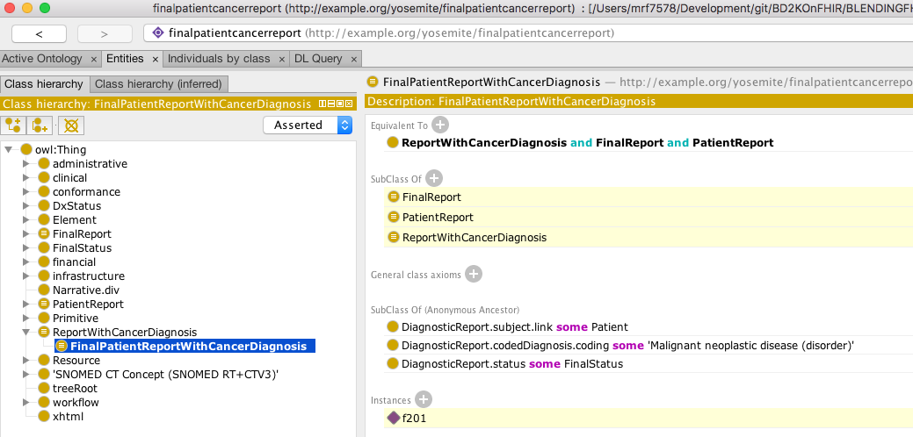
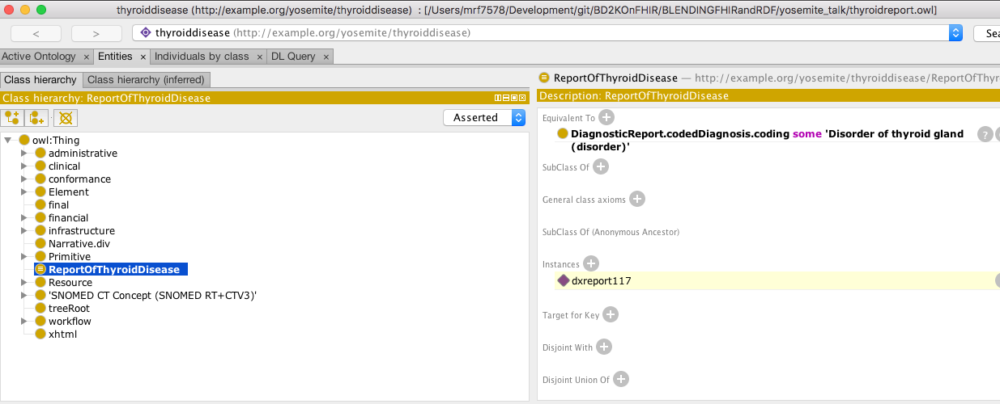

# FHIR RDF as a Bridge to the Semantic Web in Healthcare

## Introduction

  

    Show details
  

This tutorial demonstrates how one or more FHIR resources in RDF format can be processed by a reasoner to determine if the given FHIR resource is an instance of a particular Class (as defined in a ontology). Here we use an example of a FHIR DiagnosticReport resource instance that has a diagnosis of malignant neoplasm. We shall feed this FHIR resource into a Description Logics (DL) reasoner to determine if it belongs to a Class called ‘CancerDiagnosis’. This type of exercise can be useful in primary and secondary care institutions to determine the overall number of patients that belong to a particular group of diagnoses, for e.g. Cancer.

This tutorial is based on a [webinar presented by Harold R. Solbrig](http://yosemiteproject.org/fhir-rdf-as-a-bridge-to-the-semantic-web-in-healthcare/) of Mayo Clinic as part of Yosemite Project.

## Background

  

    Show details
  

Ontologies that were designed independently almost always have some impedance mismatch when attempting to use them together. Many of the ontologies in the medical and life sciences domain are designed to capture facts about the world for research, such as the fact that the mitral valve is a kind of heart valve. But FHIR was designed to support the day-to-day operations of healthcare providers exchanging electronic health records (EHRs), and in this context the orientation has historically been different. When using FHIR/RDF with other ontologies, impedence differences are likely to show up in two main ways:

* Records versus facts. FHIR is oriented toward recording who did what ("Dr. Jones diagnosed patient x with viral pneumonia") rather than stating absolute medical facts ("patient x has viral pneumonia").

* Non-monotonicity. RDF was designed to be monotonic, whereas FHIR has a few design aspects that are would be non-monotonic if they were interpreted directly in RDF. (Monotonicity means that new data cannot invalidate previous conclusions; non-monotonicity means that previous conclusions can be invalidated by new data.) For example, a modifier extension indicates that the surrounding element's meaning will likely be misunderstood if the modifier extension is not understood.

For both of these reasons, to maintain monotonicity in RDF, FHIR/RDF should not be directly interpreted as stating facts, at least until any potentially non-monotonic elements have been removed or isolated through pre-processing.

Application developers should also be aware that some FHIR data attributes have a major impact on the interpretation of the enclosing data element: the meaning of the enclosing element cannot be determined in isolation. For example, a status of 'entered-in-error' means that the resource was created accidentally, and should be ignored ([source](https://www.hl7.org/fhir/linked-data-module.html)).

## Target audience
* Anyone interested in using FHIR/RDF to perform inference using the SNOMED-CT ontology.

## Prerequisites

  

    Show details
  

  
This tutorial assumes the reader has some background knowledge of the following technologies:

* Semantic web technologies and standards
  * OWL, RDF
  * Protege ontology editor
* Health informatics standards
  * SNOMED CT
  * HL7 FHIR
  

  
## Resources

  

    Show details
  

### Files

* [Blending FHIR RDF and OWL](http://www.swat4ls.org/wp-content/uploads/2017/11/SWAT4LS-2017_paper_28.pdf)
* [slides.pdf](slides.pdf) -- Presentation slides

#### Classifiers

* [cancerreport.owl](cancerreport.owl) -- class definition for `DiagnosticReport` having a diagnosis of [346325008: Malignant neoplastic disease](http://snomed.info/id/346325008)
* [patientreport.owl](patientreport.owl) -- class definition for `DiagnosticReport` whose subject is a reference to a fhir:Patient
* [finalreport.owl](finalreport.owl) -- class definition for `DiagnsosticReport` whose status meets a local definition of "finalized"
* [finalreport_data.owl](finalreport_data.owl) -- class definition for `DiagnosticReport` whose stats **text** matches what we think counts as "finalized"
* [fullreport.owl](fullreport.owl) -- class definition for a finalized `DiagnosticReport` on a patient with a cancer diagnosis
* [thyroidreport.owl](thyroidreport.owl) -- class definition for `DiagnosticReport` having a diagnosis of [14304000: Disorder of thyroid gland (disorder)](http://snomed.info/id/14304000)

#### Data

* [diagnosticreport-example-f201-brainct.ttl](diagnosticreport-example-f201-brainct.ttl)
* [diagnosticreport-example-thyroidtumor.ttl](diagnosticreport-example-thyroidtumor.ttl)
* [imagingstudy-example-xr.ttl](imagingstudy-example-xr.ttl)
* [imagingstudy-example-xr-mod.ttl](imagingstudy-example-xr_mod.ttl) -- Imaging study w/ sample laterailty transformation

##### Ontologies and the like

* [codesystem-diagnostic-report-status.owl](codesystem-diagnostic-report-status.owl) -- proposed OWL representation of the `DiagnosticReport.status` code system
* [fhir.ttl](fhir.ttl) -- FHIR Metadata vocabulary with offending `xsd:date`, `xsd:time`, `xsd:base64Binary` and `fhir:xhtml` data types changed to `xsd:dateTime` and `xsd:string`
* [w5.ttl](w5.ttl) -- local copy of the FHIR 5 W's ontology
* [snomed_cancer_subset.ttl](snomed_cancer_subset.ttl) -- an OWL representation of the transitive closure and neighborhood of concepts:
  * [18834000: Malignant tumor if craniopharyngeal duct (disorder)](http://snomed.info/id/188340000)
  * [394914008: Radiology - speciality (qualifier value)](http://snomed.info/id/394914008)
  * [429858000: Computed tomography of head and neck (procedure)](http://snomed.info/id/429858000)
     see [SNOMED_CT directory](SNOMED_CT) for description of how this was generated
* [snomed_thyroid_subset.ttl](snomed_thyroid_subset.ttl) -- An OWL representation of the transitive closure of:
    * [394914008:  Radiology - specialty (qualifier value)](http://snomed.info/id/394914008)
    * [429858000:  Computed tomography of head and neck (procedure)](http://snomed.info/id/429858000)
    * [363346000:  Malignant neoplastic disease (disorder)](http://snomed.info/id/363346000)
    * [363698007:  Finding site (attribute)](http://snomed.info/id/363698007)
    * [170784008:  Entire left lobe of thyroid gland (body structure)](http://snomed.info/id/170784008)
    * [14304000:  Disorder of thyroid gland (disorder)](http://snomed.info/id/14304000)
    
    see [SNOMED_CT directory](SNOMED_CT) for description of how this was generated
	
	
#### Support

* [catalog-v001.xml](catalog-v001.xml) -- XML catalog used by Protégé.  This causes all references to be resolved locally
* [catalog-v001.backup.xml](catalog-v001.backup.xml) -- Backup copy of XML catalog as Protégé tends to scribble on these things if you so much
as look at it crosseyed
* README.md -- this file

## Steps

  

    Show details
  

  
1. Install a current version of [Protégé](https://protege.stanford.edu) (we use 5.1.0)
2. Clone a copy of the [BLENDINGFHIRandRDF](https://github.com/BD2KOnFHIR/BLENDINGFHIRandRDF) repository
3. Change to the yosemite_talk directory
3. Start Protégé and open [fullreport.owl](fullreport.owl)
4. Select the FaCT++ reasoner under the `Reasoner` menu
5. Select `Start Reasoner` under the `Reasoner` menu
6. Navigate to `FinalPatientReportWithCancerDiagnosis` in the `Class Hierarchy` tab and observe that `f201` (the id of the DiagnosticReport) has been recognized as an instance.

7. Open [thyroidreport.owl](thyroidreport.owl), answering "no" to the current window prompt.
8. Select `Start Reasoner` under the `Reasoner` menu.
9. Navigate to `ReportOfThyroidDisease` in the `Class Hierarchy` tab and observe that `dxreport117` has been classified
as an instance of thyroid disease.

