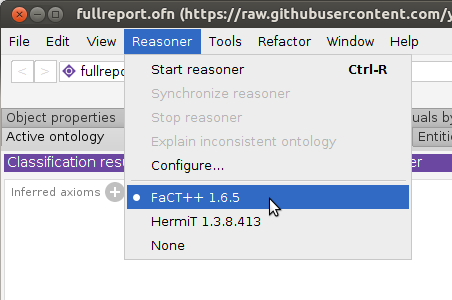
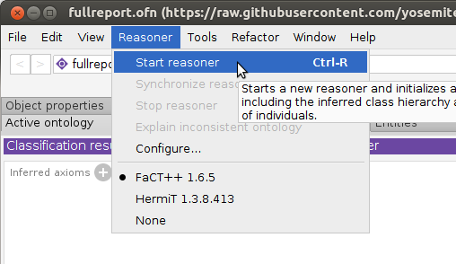

# FHIR RDF as a Bridge to the Semantic Web in Healthcare

This tutorial shows how FHIR medical records, represented in RDF, can be processed
by a reasoner to identify diagnoses that were not directly coded.  Two
examples are demonstrated.  Leveraging the
SNOMED CT ontology, a FHIR DiagnosticReport for malignant
neoplasm is inferred to be an instance of CancerDiagnosis; and
a report of a thyroid tumor is inferred to be a thyroid disease diagnosis.

This approach is useful in primary and
secondary care institutions to determine the number of patients
that belong to a particular group of diagnoses.
Instead of explicitly querying for every possible kind of report
that would indicate the target diagnosis -- such as cancer or thyroid 
disease -- 
the reasoner uses SNOMED CT's ontology to infer that diagnosis based
on its subclass relationships.

This tutorial is based on a 
[Yosemite Project webinar](http://yosemiteproject.org/fhir-rdf-as-a-bridge-to-the-semantic-web-in-healthcare/)
and a [paper from the 2017 International SWAT4HCLS Conference](http://www.swat4ls.org/wp-content/uploads/2017/11/SWAT4LS-2017_paper_28.pdf)
by Harold R. Solbrig of Mayo Clinic.  

## Target audience
Anyone interested in using FHIR/RDF to perform inference using the SNOMED-CT ontology.

## Prerequisites
* Familiarity with semantic web technologies and standards, including [OWL](http://www.w3.org/TR/owl-primer), [RDF](https://www.w3.org/TR/rdf11-primer/), and the [Protege ontology editor](https://protege.stanford.edu/)
* Familiarity with health informatics standards, including [SNOMED CT](https://en.wikipedia.org/wiki/SNOMED_CT) and [HL7 FHIR](https://www.hl7.org/fhir/)
  
## Steps
  
1. Install a current version of [Protege](https://protege.stanford.edu/products.php) (We tested this tutorial on 5.1.0 and 5.5.0beta7.)

2. Clone a copy of [this repository](https://github.com/yosemiteproject/Tutorial-FHIR-RDF-as-a-Bridge), which contains the files for this tutorial, and change to that directory.

```
git clone https://github.com/yosemiteproject/Tutorial-FHIR-RDF-as-a-Bridge
cd Tutorial-FHIR-RDF-as-a-Bridge
```

3. Start Protege.  If you get an "Automatic Update" dialog, you may dismiss it
by clicking "Not now".


4. Verify that the FaCT++ reasoner is installed: click the Reasoner menu to see if FaCT++ is listed.  If not, install it directly from Protege: File-->Check for plugins..., check "FaCT++ reasoner", Install, then exit and restart Protege.


5. Open [fullreport.owl](fullreport.owl): File-->Open.
This OWL file references a sample FHIR/RDF patient data record (f201.ttl)
that we will identify as a cancer diagnosis, using the FaCT++ reasoner.  
It also references the various FHIR and SNOMED CT ontology pieces that enable 
the reasoner to reach this conclusion.


6. If needed, resolve missing imports using the files in this git repository as follows:
```
http://snomed.info/sct/900000000000207008cancer_subset --> snomed_cancer_subset.ttl
http://hl7.org/fhir/fhir.ttl --> fhir.ttl
http://hl7.org/fhir/DiagnosticReport/f201.ttl --> diagnosticreport-example-f201-brainct.ttl
https://raw.githubusercontent.com/yosemiteproject/Tutorial-FHIR-RDF-as-a-Bridge/master/patientreport.owl --> patientreport.owl
https://raw.githubusercontent.com/yosemiteproject/Tutorial-FHIR-RDF-as-a-Bridge/master/cancerreport.owl --> cancerreport.owl
https://raw.githubusercontent.com/yosemiteproject/Tutorial-FHIR-RDF-as-a-Bridge/master/finalreport.owl --> finalreport.owl
```


6. Select the FaCT++ reasoner under the `Reasoner` menu


7. Select `Start Reasoner` under the `Reasoner` menu



8. Navigate to `FinalPatientReportWithCancerDiagnosis` in the `Classes`-->`Class hierarchy` tab and observe that `f201` (the id of the DiagnosticReport) has been recognized as an instance.


9. Open [thyroidreport.owl](thyroidreport.owl), answering "no" to the current window prompt.

10. Select `Start Reasoner` under the `Reasoner` menu.

11. Navigate to `ReportOfThyroidDisease` in the `Class Hierarchy` tab and observe that `dxreport117` has been classified
as an instance of thyroid disease.


## File list (for reference)
To further understand how this demo works, examine the roles and contents of
the files listed below.  These files are included when you clone the 
[BLENDINGFHIRandRDF](https://github.com/BD2KOnFHIR/BLENDINGFHIRandRDF) repository in step 2 above.
<details>
  <summary>
<i>Show/hide file list</i>
  </summary>

### Class definitions
These files specify the kinds of diagnoses that we wish to identify,
such as cancer or thyroid disease.

* [cancerreport.owl](cancerreport.owl) -- class definition for `DiagnosticReport` having a diagnosis of [346325008: Malignant neoplastic disease](http://snomed.info/id/346325008)
* [patientreport.owl](patientreport.owl) -- class definition for `DiagnosticReport` whose subject is a reference to a fhir:Patient
* [finalreport.owl](finalreport.owl) -- class definition for `DiagnsosticReport` whose status meets a local definition of "finalized"
* [finalreport_data.owl](finalreport_data.owl) -- class definition for `DiagnosticReport` whose stats **text** matches what we think counts as "finalized"
* [fullreport.owl](fullreport.owl) -- class definition for a finalized `DiagnosticReport` on a patient with a cancer diagnosis
* [thyroidreport.owl](thyroidreport.owl) -- class definition for `DiagnosticReport` having a diagnosis of [14304000: Disorder of thyroid gland (disorder)](http://snomed.info/id/14304000)

### Instance data
These files represent the FHIR medical reports that are to be analyzed to
to determine whether they represent the target diagnosis, such as
cancer or thyroid disease.

* [diagnosticreport-example-f201-brainct.ttl](diagnosticreport-example-f201-brainct.ttl)
* [diagnosticreport-example-thyroidtumor.ttl](diagnosticreport-example-thyroidtumor.ttl)
* [imagingstudy-example-xr.ttl](imagingstudy-example-xr.ttl)
* [imagingstudy-example-xr-mod.ttl](imagingstudy-example-xr_mod.ttl) -- Imaging study w/ sample laterailty transformation

### Ontologies / vocabularies
These are standard SNOMED CT and FHIR ontologies/vocabularies that we
have downloaded for use in this analysis.

* [codesystem-diagnostic-report-status.owl](codesystem-diagnostic-report-status.owl) -- proposed OWL representation of the `DiagnosticReport.status` code system
* [fhir.ttl](fhir.ttl) -- FHIR Metadata vocabulary with offending `xsd:date`, `xsd:time`, `xsd:base64Binary` and `fhir:xhtml` data types changed to `xsd:dateTime` and `xsd:string`
* [w5.ttl](w5.ttl) -- local copy of the FHIR 5 W's ontology
* [snomed_cancer_subset.ttl](snomed_cancer_subset.ttl) -- an OWL representation of the transitive closure and neighborhood of concepts:
  * [18834000: Malignant tumor if craniopharyngeal duct (disorder)](http://snomed.info/id/188340000)
  * [394914008: Radiology - speciality (qualifier value)](http://snomed.info/id/394914008)
  * [429858000: Computed tomography of head and neck (procedure)](http://snomed.info/id/429858000)
     see [SNOMED_CT directory](SNOMED_CT) for description of how this was generated
* [snomed_thyroid_subset.ttl](snomed_thyroid_subset.ttl) -- An OWL representation of the transitive closure of:
    * [394914008:  Radiology - specialty (qualifier value)](http://snomed.info/id/394914008)
    * [429858000:  Computed tomography of head and neck (procedure)](http://snomed.info/id/429858000)
    * [363346000:  Malignant neoplastic disease (disorder)](http://snomed.info/id/363346000)
    * [363698007:  Finding site (attribute)](http://snomed.info/id/363698007)
    * [170784008:  Entire left lobe of thyroid gland (body structure)](http://snomed.info/id/170784008)
    * [14304000:  Disorder of thyroid gland (disorder)](http://snomed.info/id/14304000)
    
    see [SNOMED_CT directory](SNOMED_CT) for description of how this was generated
	
	
### Misc.
These files are generated by Protege.

* [catalog-v001.xml](catalog-v001.xml) -- XML catalog used by Protege.  This causes all references to be resolved locally
* [catalog-v001.backup.xml](catalog-v001.backup.xml) -- Backup copy of XML catalog as Protege tends to scribble on these things if you so much
as look at it crosseyed
</details>


