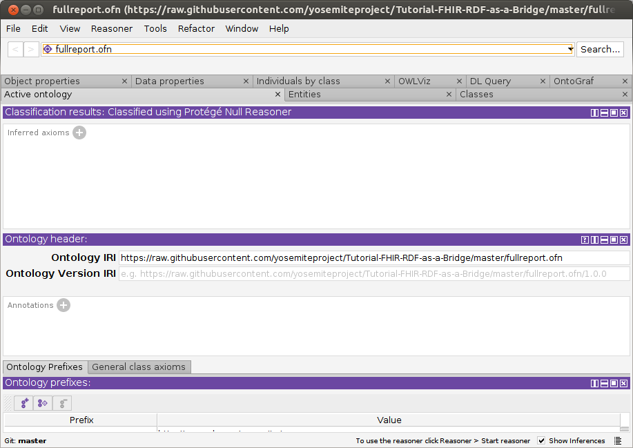
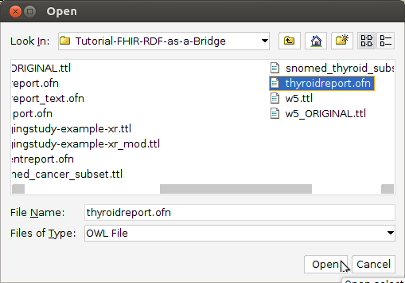

# FHIR RDF as a Bridge to the Semantic Web in Healthcare

This tutorial shows how FHIR RDF medical records using SNOMED-CT can be processed
by a reasoner to identify diagnoses that were not directly coded.  Two
examples are demonstrated:
a FHIR DiagnosticReport for malignant
neoplasm is inferred to be an instance of CancerDiagnosis; and
a report of a thyroid tumor is inferred to be a thyroid disease diagnosis.

This approach is useful in primary and
secondary care institutions to count or identify patients
that belong to a particular group of diagnoses.
Instead of explicitly querying for every possible code
that would indicate the target diagnosis -- such as cancer or thyroid 
disease -- 
the reasoner uses SNOMED-CT's ontology to infer that diagnosis based
on subclass relationships.

This tutorial is based on a 
[Yosemite Project webinar](http://yosemiteproject.org/fhir-rdf-as-a-bridge-to-the-semantic-web-in-healthcare/)
and a [paper from the 2017 International SWAT4HCLS Conference](http://www.swat4ls.org/wp-content/uploads/2017/11/SWAT4LS-2017_paper_28.pdf)
by Harold R. Solbrig of Mayo Clinic.  

## Target audience
Anyone interested in using FHIR/RDF to perform inference using the SNOMED-CT ontology.

## Prerequisites
* Familiarity with semantic web technologies and standards, including [OWL](http://www.w3.org/TR/owl-primer), [RDF](https://www.w3.org/TR/rdf11-primer/), and the [Protege ontology editor](https://protege.stanford.edu/)
* Familiarity with health informatics standards, including [SNOMED-CT](https://en.wikipedia.org/wiki/SNOMED_CT) and [HL7 FHIR](https://www.hl7.org/fhir/)
  
## Steps
  
1. Install a current version of [Protege](https://protege.stanford.edu/products.php).  This tutorial was tested on 5.5.0beta8 and 5.5.0beta9.

2. Clone a copy of [this repository](https://github.com/yosemiteproject/Tutorial-FHIR-RDF-as-a-Bridge/master), which contains the files for this tutorial, and change to that directory.

```
git clone https://github.com/yosemiteproject/Tutorial-FHIR-RDF-as-a-Bridge/master
cd Tutorial-FHIR-RDF-as-a-Bridge/master
```

3. Start Protege.  If you get an "Automatic Update" dialog, you may dismiss it
by clicking "Not now".



4. Verify that the FaCT++ reasoner is installed: click the Reasoner menu to see if FaCT++ is listed.  If not, install it directly from Protege: File-->Check for plugins..., check "FaCT++ reasoner", Install, then exit and restart Protege.


5. Open [fullreport.ofn](fullreport.ofn): File-->Open.
This OWL file references a sample FHIR/RDF patient data record (f201.ttl)
that we will identify as a cancer diagnosis, using the FaCT++ reasoner.  
It also references the various FHIR and SNOMED-CT ontology pieces that enable 
the reasoner to reach this conclusion.

If needed, resolve missing imports using these local files:
```
snomed_cancer_subset.ttl
fhir.ttl
diagnosticreport-example-f201-brainct.ttl
patientreport.ofn
cancerreport.ofn
finalreport.ofn
```


6. Select the FaCT++ reasoner under the `Reasoner` menu.


7. Select `Start Reasoner` under the `Reasoner` menu.  It may take ~30
seconds to run on a 3.4GHz laptop.


8. Navigate to `FinalPatientReportWithCancerDiagnosis` in the `Classes`-->`Class hierarchy` tab and observe that `f201` (the id of the DiagnosticReport) has been recognized as an instance.  Success!
This means that the reasoner has concluded that this patient record (f201)
has a cancer diagnosis.


Next, we will test a different patient record for a thyroid disease diagnosis.

9. Open [thyroidreport.ofn](thyroidreport.ofn), answering "no" to the current window prompt.
Again, this file imports the ontologies that we need, imports the patient
record that will be tested (diagnosticreport-example-dxreport117-thyroidtumor.ttl),
and defines our target diagnosis class (:ReportOfThyroidDisease)
as being anything classified in SNOMED-CT as a
disorder of the thyroid gland (code sct:14304000).


10. Select `Start Reasoner` under the `Reasoner` menu.  It may take ~2 minutes
to run on a 3.4GHz laptop.


11. Navigate to `ReportOfThyroidDisease` in the `Class Hierarchy` tab and observe that `dxreport117` has been classified
as an instance of thyroid disease.


## How it works
To further understand how this demo works, examine the roles and contents of
the files listed below.  These files were included when you cloned the 
repository in step 2 above.

### Class definitions
These files specify the kinds of diagnoses that we wish to identify,
such as cancer or thyroid disease.

* [fullreport.ofn](fullreport.ofn) -- Class definition for `:FinalPatientReportWithCancerDiagnosis`, which is a final patient report of cancer diagnosis.  This class is the intersection of three separately defined classes:
** `:PatientReport` -- The class of patient reports, defined in [patientreport.ofn](patientreport.ofn)
** `:FinalReport` -- The class of reports with a status that we consider final, defined in [patientreport.ofn](patientreport.ofn)
** `:ReportWithCancerDiagnosis` -- The class of reports that have cancer diagnoses, defined in [finalreport.ofn](finalreport.ofn)
a finalized `DiagnosticReport` on a patient with a cancer diagnosis
* [patientreport.ofn](patientreport.ofn) -- Class definition for `:PatientReport`, i.e., reports whose subject is a fhir:Patient
* [finalreport.ofn](finalreport.ofn) -- Class definition for `:FinalReport`, i.e., reports whose status meets our criteria for finalized
* [cancerreport.ofn](cancerreport.ofn) -- Class definition for `:ReportWithCancerDiagnosis`, which are reports having a diagnosis of [346325008: Malignant neoplastic disease](http://snomed.info/id/346325008).
* [thyroidreport.ofn](thyroidreport.ofn) -- Class definition for `:ReportOfThyroidDisease`, which are reports having a diagnosis of [14304000: Disorder of thyroid gland (disorder)](http://snomed.info/id/14304000).
* [finalreport_text.ofn](finalreport_text.ofn) -- [Not used in this tutorial]  Class definition for `:FinalReport` whose status **text** matches what we think counts as "finalized".  This is a potential alternate way of defining the `:FinalReport` class.

### Instance data
These files represent the FHIR medical reports that are to be analyzed to
to determine whether they represent the target diagnosis, such as
cancer or thyroid disease.

* [diagnosticreport-example-f201-brainct.ttl](diagnosticreport-example-f201-brainct.ttl)
* [diagnosticreport-example-dxreport117-thyroidtumor.ttl](diagnosticreport-example-dxreport117-thyroidtumor.ttl)
* [imagingstudy-example-xr.ttl](imagingstudy-example-xr.ttl)
* [imagingstudy-example-xr-mod.ttl](imagingstudy-example-xr_mod.ttl) -- Imaging study with sample laterality transformation

### Ontologies / vocabularies
These are standard SNOMED-CT and FHIR ontologies/vocabularies that we
have downloaded for use in this analysis.   Ideally these ontologies
should be usable as-is.  However, as of this writing there are some
exceptions, as described below.

* [codesystem-diagnostic-report-status.ttl](codesystem-diagnostic-report-status.ttl) -- proposed OWL representation of the `DiagnosticReport.status` code system.  This mini-ontology has not yet been standardized, but (as of this writing) the [FHIR/RDF group](http://wiki.hl7.org/index.php?title=ITS_RDF_ConCall_Agenda) is working toward generating it from the FHIR specification [build process](http://wiki.hl7.org/index.php?title=FHIR_Build_Process) as a standard downloadable ontology.
* [fhir.ttl](fhir.ttl) -- FHIR Metadata vocabulary with offending `xsd:date`, `xsd:time`, `xsd:base64Binary` and `fhir:xhtml` data types changed to `xsd:dateTime` and `xsd:string`
* [w5.ttl](w5.ttl) -- local copy of the FHIR 5 W's ontology -- [Who, What, When, Where, Why](https://www.hl7.org/fhir/fivews.html)
* [snomed_cancer_subset.ttl](snomed_cancer_subset.ttl) -- an OWL representation of the transitive closure and neighborhood of concepts:
  * [18834000: Malignant tumor if craniopharyngeal duct (disorder)](http://snomed.info/id/188340000)
  * [394914008: Radiology - speciality (qualifier value)](http://snomed.info/id/394914008)
  * [429858000: Computed tomography of head and neck (procedure)](http://snomed.info/id/429858000)
     see [SNOMED_CT directory](SNOMED_CT) for description of how this was generated
* [snomed_thyroid_subset.ttl](snomed_thyroid_subset.ttl) -- An OWL representation of the transitive closure of:
    * [394914008:  Radiology - specialty (qualifier value)](http://snomed.info/id/394914008)
    * [429858000:  Computed tomography of head and neck (procedure)](http://snomed.info/id/429858000)
    * [363346000:  Malignant neoplastic disease (disorder)](http://snomed.info/id/363346000)
    * [363698007:  Finding site (attribute)](http://snomed.info/id/363698007)
    * [170784008:  Entire left lobe of thyroid gland (body structure)](http://snomed.info/id/170784008)
    * [14304000:  Disorder of thyroid gland (disorder)](http://snomed.info/id/14304000)
    
    see [SNOMED_CT directory](SNOMED_CT) for description of how this was generated
	
	
### Misc.
These files are generated by Protege.

* [catalog-v001.xml](catalog-v001.xml) -- XML catalog used by Protege.  This causes all references to be resolved locally
* [catalog-v001.backup.xml](catalog-v001.backup.xml) -- Backup copy of XML catalog as Protege tends to scribble on these things if you so much
as look at it crosseyed


